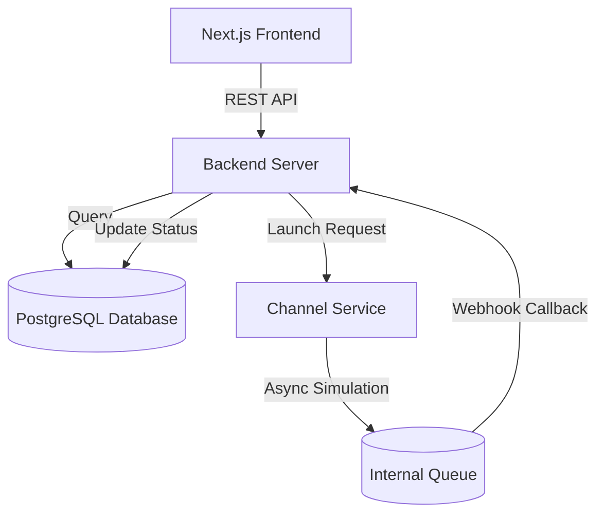

# XenoPilot Backend

XenoPilot Backend is a highly scalable, asynchronous Python architecture powering the XenoPilot AI CRM application. It consists of a primary FastAPI web server and an independent Channel Delivery Service.

## 🚀 Features

- **AI-Powered Audience Generation**: Translates natural language queries into structured database queries to segment user populations.
- **Campaign Prediction**: Simulates open rates, CTRs, and conversion rates based on historical channel efficiency.
- **Independent Channel Delivery**: A decoupled service that mocks sending messages across WhatsApp, SMS, and Email, feeding webhooks back to the main server.
- **Asynchronous Webhooks**: Handles high-concurrency event ingestion from the channel service.
- **Data Seeding**: Automated `seed_data.py` script for populating realistic test environments.

## 🏗️ Architecture



## 🛠️ Tech Stack

- **Framework**: FastAPI (Python 3.11+)
- **ORM & Validation**: SQLAlchemy, Pydantic
- **Database**: PostgreSQL (via Docker Compose)
- **Channel Service**: Independent FastAPI microservice

## 💻 Local Setup

1. **Clone the repository:**
   ```bash
   git clone https://github.com/your-username/XenoPilot-Backend.git
   cd XenoPilot-Backend
   ```

2. **Start the Database:**
   ```bash
   docker-compose up -d
   ```

3. **Install Dependencies (Backend):**
   ```bash
   cd backend
   python -m venv venv
   source venv/Scripts/activate # On Windows
   pip install -r requirements.txt
   ```

4. **Run Seed Script:**
   ```bash
   python -m seed.seed_data
   ```

5. **Start Main Server:**
   ```bash
   uvicorn main:app --reload --port 8000
   ```

6. **Start Channel Service:**
   Open a new terminal:
   ```bash
   cd channel-service
   pip install -r requirements.txt
   uvicorn main:app --reload --port 8001
   ```

## 🌐 API Documentation

Once the server is running, you can view the fully interactive Swagger UI documentation at:
`http://localhost:8000/docs`

Key Endpoints:
- `POST /api/audience/generate`: Segment audience via natural language.
- `POST /api/campaigns/predict`: Predict campaign outcomes.
- `POST /api/campaigns/{id}/launch`: Trigger channel service execution.
- `POST /api/webhooks/delivery`: Receive delivery status updates from the Channel Service.

## 🚀 Deployment Details

**Backend (Render/Railway):**
- Configure your deployment platform to use Python 3.11+.
- Root directory: `/backend`
- Start Command: `uvicorn main:app --host 0.0.0.0 --port $PORT`
- Set `DATABASE_URL` and `CHANNEL_SERVICE_URL`.

**Channel Service (Render/Railway):**
- Root directory: `/channel-service`
- Start Command: `uvicorn main:app --host 0.0.0.0 --port $PORT`
- Set `MAIN_BACKEND_URL` to point back to the deployed backend for webhooks.
